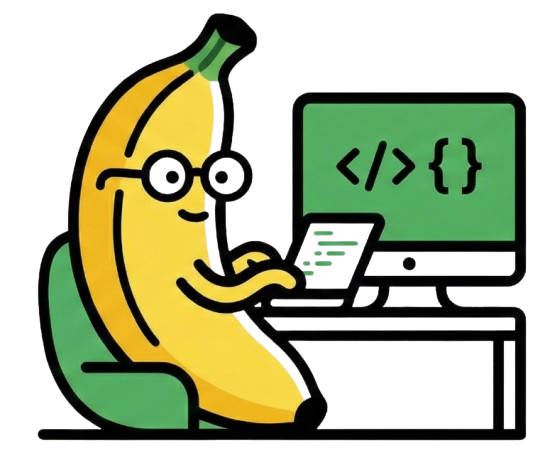
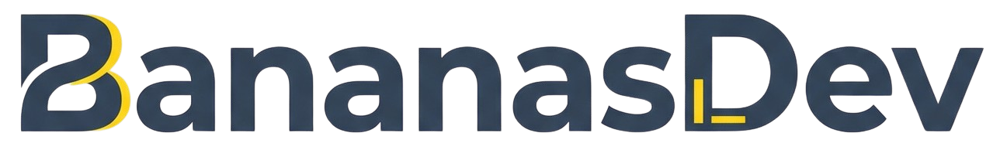

  
   
  

  <h1 align="center">BananasDev | Software Solutions</h1>

  

    <strong>Transformamos ideas complejas en software de alto rendimiento.</strong>
  

  

    <a href="#-servicios">Servicios</a> •
    <a href="#-stack-tecnológico">Stack</a> •
    <a href="#-el-escuadrón">Equipo</a> •
    <a href="#-contacto">Contacto</a>
  

  
  
  

---

## 🚀 Sobre Nosotros

**BananasDev** es una agencia de desarrollo de software ágil y moderna. Nos especializamos en crear ecosistemas digitales completos, desde la arquitectura de base de datos hasta la experiencia de usuario final en móviles y web.

No solo escribimos código; diseñamos soluciones escalables impulsadas por **Inteligencia Artificial** y arquitecturas robustas.

## 🛠 Stack Tecnológico

Utilizamos las herramientas más potentes del mercado para garantizar velocidad y seguridad:

| Área | Tecnologías |
| :--- | :--- |
| **Backend** |    |
| **Frontend** |    |
| **Mobile** |   |
| **Data & AI** |   |
| **DevOps** |    |

## 👥 El Escuadrón

Nuestro equipo multidisciplinario está listo para cualquier reto:

| Rol | Miembro | Especialidad |
| :--- | :--- | :--- |
| **CEO & Lead Architect** | 👑 **Alexis Reynaga** | Arquitectura de Software, Estrategia & Full Stack. |
| **Senior Backend Dev** | 🛡️ **Luis Rodriguez** | Laravel, Bases de Datos & Seguridad. |
| **Lead Frontend & UX** | 🎨 **Axel Loredo** | React, Tailwind & Experiencia de Usuario. |
| **Mobile Specialist** | 📱 **Ricardo Salinas** | Desarrollo Nativo iOS/Android con Flutter. |
| **AI & Data Engineer** | 🤖 **Kevin Don** | Machine Learning, Python & Chatbots. |

## 📬 Contacto

¿Tienes un proyecto en mente? ¡Hablemos!

* 📧 **Email:** bananasdevelopment@gmail.com
* 💼 **LinkedIn:** [BananasDev](https://linkedin.com)
* 🌐 **Web:** [bananasdev.com](https://bananasdev.com)

---

  © 2025 BananasDev. Code with 💛 and ☕.

