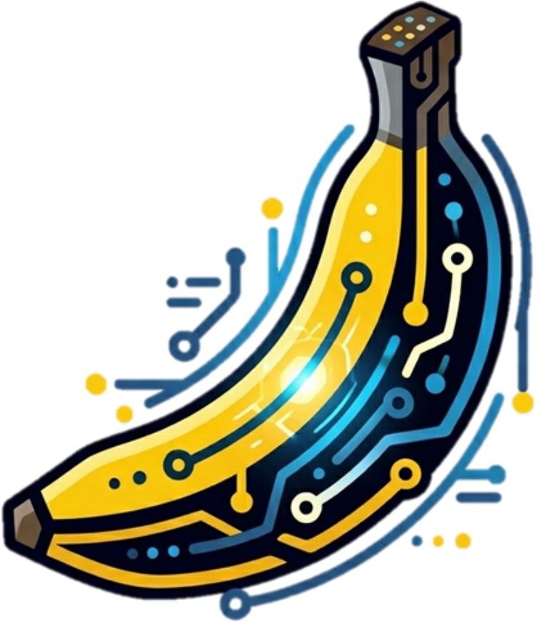
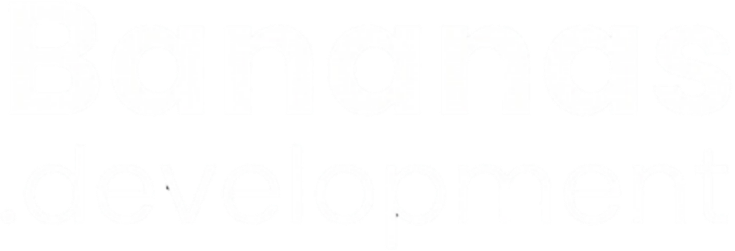

  
   
  

  <h1 align="center">BananasDev | Desarrollo de software a medida</h1>

  

    <strong>Convertimos problemas operativos en ecosistemas digitales escalables.</strong>
  

  

    <a href="#-sobre-nosotros">Nosotros</a> •
    <a href="#-stack-tecnológico">Stack</a> •
    <a href="#-el-escuadrón">Equipo</a> •
    <a href="#-proceso">Proceso</a> •
    <a href="#-contacto">Contacto</a>
  

  
  
  

---

## 🚀 Sobre Nosotros

**BananasDev** es un estudio de desarrollo de software a medida. Diseñamos y construimos ecosistemas digitales completos: desde la base de datos y la lógica de servidor, hasta interfaces web reactivas y aplicaciones móviles.

No solo escribimos código: entregamos **soluciones escalables**, con arquitecturas robustas y aprovechando **Inteligencia Artificial** donde aporta valor real.

## 🧩 Servicios

- **Desarrollo Web** — sitios y plataformas reactivas, performantes y mantenibles.
- **Apps móviles** — experiencias nativas y multiplataforma con Flutter.
- **Soluciones de IA** — modelos, automatizaciones y agentes integrados al producto.

## 🛠 Stack Tecnológico

| Área | Tecnologías |
| :--- | :--- |
| **Backend** |     |
| **Frontend** |     |
| **Mobile** |   |
| **Data & AI** |    |
| **DevOps** |    |

## 👥 El Escuadrón

Equipo multidisciplinario de ingenieros. Cada uno aporta una especialidad, todos comparten un estándar.

| Miembro | Rol | Especialidad | Portafolio |
| :--- | :--- | :--- | :--- |
| **Alexis Reynaga** | Frontend & Deploy | Interfaces reactivas, despliegue cloud e infraestructura. | [alexisreynaga.github.io](https://alexisreynaga.github.io/) |
| **Luis Rodriguez** | Data Analyst & DB | Análisis de datos, modelado y administración de bases de datos. | — |
| **Axel Loredo** | Backend & Automatización | Lógica de servidor, integraciones y automatización de procesos. | [siraxlord.github.io](https://siraxlord.github.io) |
| **Ricardo Salinas** | Backend Developer | APIs robustas, lógica de negocio y arquitectura del lado del servidor. | [rica-2000.github.io](https://rica-2000.github.io/) |

## 🔄 Proceso

Cuatro fases. Entregas continuas. Validación constante.

1. **Discovery** — análisis de requerimientos, objetivos del negocio y definición técnica del alcance.
2. **Diseño** — prototipado UI/UX, wireframes interactivos y arquitectura del sistema.
3. **Desarrollo** — sprints ágiles con entregas semanales, pruebas automatizadas y revisión continua.
4. **Lanzamiento** — deploy en infraestructura cloud, monitoreo activo y soporte post-lanzamiento.

## 📬 Contacto

¿Tienes un proyecto en mente? Respondemos en menos de 24 horas.

* 📧 **Email:** bananasdevelopment@gmail.com
* 🌐 **Web:** [bananasdevelopment.github.io](https://bananasdevelopment.github.io/)

---

  Hecho con código limpio · © 2026 BananasDev

